# HỌC GOLANG

## MỤC LỤC

<!-- Đã xóa phần #id-section1 -->
- [Các nguồn tự học Golang](#id-section2)
    - [Nguồn học hữu ích](#id-section2-1)
    - [Nguồn hướng dẫn cài đặt](#id-section2-2)
    - [Các thư viện cần thiết](#id-section2-3)
    - [Hướng dẫn kiến trúc clean](#id-section2-4)
- [Bài tập thực hành](#id-section3)
    - [Đề bài tập](#id-section3-1)
    - [Kết quả thực hiện](#id-section3-2)
        - [Thời gian thực hiện](#id-section3-2-1)
        - [Dữ liệu của bài tập](#id-section3-2-2)
        - [Công cụ sử dụng](#id-section3-2-3)
        - [Data model](#id-section3-2-4)
        - [Architecture](#id-section3-2-5)
        - [Sequence diagram](#id-section3-2-6)
        - [Tổ chức thư mục của bài tập](#id-section3-2-7)
        - [Ngoài lề](#id-section3-2-8)
        - [Performance test](#id-section3-2-9)
        - [SSL/TLS](#id-section3-2-10)  
        - [Tình hình](#id-section3-2-11)

<div id='id-section2'/>

## CÁC NGUỒN TỰ HỌC GOLANG

<div id='id-section2-1'/>

1. Nguồn học hữu ích:
    * [Go TechMaster](https://techmaster.vn/posts?keyword=golang&category=&author=), với nhiều bài học hữu ích được trình bày bằng ngôn ngữ Việt. Nếu học bằng ngôn ngữ Anh, có thể vào [GeeksforGeeks](https://www.geeksforgeeks.org/identifiers-in-go-language/?ref=lbp).
    * [A Tour of Golang](https://tour.golang.org/list), là trang web chính thống học Golang với các bài học được chia thành từng phần.
    * [ZaloPay Advanced Gobook](https://github.com/zalopay-oss/go-advanced), quyển sách được viết bởi các kỹ sư tại ZaloPay, VNG. Có 2 hình thức đọc là PDF và Online GitBook.

<div id='id-section2-2'/>

2. Nguồn hướng dẫn cài đặt:
    * IDE tốt để sử dụng: Goland của JetBrains (có thể dùng tài khoản email sinh viên `*.edu` để đăng ký sử dụng).
    * Hướng dẫn cài đặt Golang: [Golang.org](https://golang.org/doc/install).

<div id='id-section2-3'/>

3. Các thư viện cần thiết:
    * Database ORM: 
        * [Github of GORM](http://gorm.io/docs/index.html)
        * [Tutorial GORM on Mindbowser.com](https://www.mindbowser.com/golang-go-with-gorm/)
    * Go Gin (Giống như Express trong NodeJs): 
        * [Github of GoGin](https://github.com/gin-gonic/gin)
        * [HTTP status code](https://www.iana.org/assignments/http-status-codes/http-status-codes.xhtml)
    * Bcrypt: 
        * [Tutorial Bcrypt on Medium.com](https://medium.com/@jcox250/password-hash-salt-using-golang-b041dc94cb72?fbclid=IwAR0ykX4rLm2IkN1icM7iLmO9nQBGaUlAChdIewgZDxY18hbllcJTiuI_nv8)
    * Redis:
        * [Github of Redis](https://github.com/go-redis/redis)
    * Kafka:
        * [Github of Segmentio, kafka-go](https://github.com/segmentio/kafka-go)
        * [Github of Shopify, sarama](https://github.com/Shopify/sarama)
    * gRPC:
        * [Github of gRPC](https://github.com/grpc/grpc-go)
    * ...more...

<div id='id-section2-4'/>

4. Hướng dẫn kiến trúc clean (chỉ tham khảo): 
    * [Tutorial of TMA](https://www.tma.vn/Hoi-dap/Cam-nang-nghe-nghiep/Kien-truc-sach-voi-Golang/22031?fbclid=IwAR1HedxXCyF6DOHDoiJpxjlBWWuJaRsEqaCzItTAmdJF3TaMCaNsYxglZaQ)
    * [Github of Demo Clean Architecture](https://github.com/bxcodec/go-clean-arch/tree/master/author)

<div id='id-section3'/>

## BÀI TẬP THỰC HÀNH

<div id='id-section3-1'/>

### ĐỀ BÀI TẬP

* Tên đề bài: Thiết kế hệ thống cung cấp APIs cho trò chơi Oẳn tù tì với máy.
* Tên trò chơi: Oẳn tù tì - Rock Paper Scissors (RPS).
* Bài tập được tham khảo và lấy từ chương trình đào tạo ZaloPay Fresher, module Java.
* Luật chơi:
    * Mỗi 1 game sẽ gồm n lượt chơi (n >= 1).
    * Trong mỗi lượt, server sẽ trả lời là người chơi (user) thắng, thua hay hòa (kèm kết quả KÉO/BÚA/BAO của máy).
    * Nếu kết quả của lượt chơi là thắng hoặc thua, game kết thúc.
    * Nếu kết quả là hòa, user phải chơi thêm lượt tiếp theo đến khi có kết quả thắng hoặc thua.
* Yêu cầu tính năng:
    * User phải thực hiện đăng nhập mới gọi được API và server cung cấp API cho user đăng ký tài khoản.
    * Lưu lại lịch sử tất cả các game + lượt chơi của user.
    * Cung cấp API truy vấn lịch sử tất cả game của user và lượt chơi của user (dựa trên mã game cung cấp).
    * Cung cấp API liệt kê danh sách 100 user có tỉ lệ thắng cao nhất.
* Yêu cầu thiết kế:
    * Sequence diagram cho tất cả các API/Function.
    * Tài liệu mô tả architecture của hệ thống.
    * Tài liệu mô tả thiết kế lưu trữ Data Model của hệ thống.
* Yêu cầu kỹ thuật:
    * Cung cấp API cho với HTTP và JSON.
    * Cung cấp API cho với GRPC (Optional)
    * Sử dụng JWT cho phần Authentication.
    * Có thể viết 1 web client đơn giản, hoặc sử dụng Postman hoặc các công cụ khác để test API.
    * Ghi Log cho tất cả lời gọi tới API.
    * Unit/Integration test (Optional)

<div id='id-section3-2'/>

### KẾT QUẢ THỰC HIỆN

<div id='id-section3-2-1'/>

**THỜI GIAN THỰC HIỆN**

* Đây là lần đầu tiên mình học Golang và cũng là bài tập đầu tiên để học hỏi, trải nghiệm. Khoảng thời gian thực hiện là 5 ngày (23/03/2020 - 28/03/2020):
    * 1,5 ngày: Đọc tài liệu về Go (Lời giới thiệu, cách sử dụng ngôn ngữ, các cú pháp, ưu nhược điểm,...)
    * 3,5 - 4 ngày: Code và viết tài liệu trình bày những gì đã làm.
* Source code hoặc nội dung vẫn còn nhiều thiếu sót, mong bạn thông cảm!

<div id='id-section3-2-2'/>

**DỮ LIỆU CỦA BÀI TẬP**

* Thư mục `./design` gồm:
    * architecture_quoctk.pptx (Powerpoint Tool): File thiết kế hình ảnh kiến trúc của RPS.
    * datamodel_quoctk.vpp (Visual Paradigm Tool): File thiết kế data model của RPS.
    * rps_quoctk.sql (MySQL Database): File định nghĩa cấu trúc lưu trữ CSDL của RPS.
    * sequence_diagram_quoctk.EAP (Enterprise Architecture Diagram Tool): File thiết kế các sơ đồ sequence cho các mục tính năng của RPS.
    * RPSLoadTest.jms (JMeter Tool): Kịch bản thực hiện Load test cho chương trình (Import file này vào JMeter & Play)
* Thư mục `./rps-game` chứa source code của chương trình.

<div id='id-section3-2-3'/>

**CÔNG CỤ SỬ DỤNG**

* Chương trình RPS sử dụng Goland IDE để thực thi và cài đặt.
* Sử dụng JMeter để thực hiện performance test (Hoặc có thể sử dụng Locust Performance Testing Tool).
* Sử dụng PostmanCanary để test các API triển khai theo HTTP/HTTPS.

<div id='id-section3-2-4'/>

**DATA MODEL**

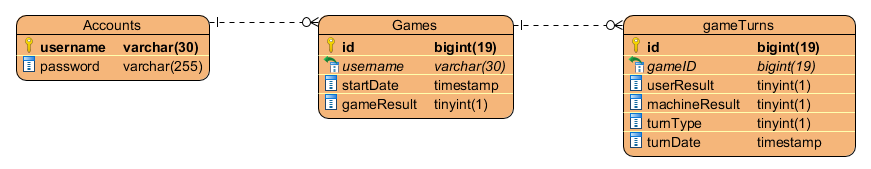

Có 3 bảng: Accounts, Games và GameTurns (Bảng chi tiết về lượt chơi)

Một tài khoản (user) chỉ cần thông tin là username và password để đăng nhập và chơi, không cần thêm bất kì thông tin khác.

Mỗi người như vậy sẽ có lịch sử Games và GameTurns mà họ đã từng chơi. Khi họ bắt đầu chơi Games, 1 dòng dữ liệu mới sẽ được thêm vào bảng Games với gameResult mặc định là 0 (0 nghĩa là thua). Nếu user chơi thắng thì gameResult sẽ được cập nhật lại thành 1. Trường hợp hòa không được xét đến ở đây bởi vì oẳn tù tì bắt buộc luôn có 1 người thắng, 1 người thua.

Bên cạnh bảng Games lưu trữ những thông tin về game, ngày mà user đã bắt đầu chơi, mà còn có bảng GameTurns thể hiện các thông tin chi tiết về lượt chơi của user. Giải thích một vài trường thông tin trong bảng GameTurns:

* userResult: Kết quả chơi của user (0: Kéo, 1: Búa, 2: Bao)
* machineResult: Kết quả chơi của máy, thực hiện theo hình thức random (0: Kéo, 1: Búa, 2: Bao)
* turnType: Kiểu lượt chơi (0: Là lượt chơi tranh đấu có kết quả thắng hoặc thua, 1: Là lượt chơi đã hòa)
* turnDate: Thời điểm user thực hiện lượt chơi của mình

<div id='id-section3-2-5'/>

**ARCHITECTURE**

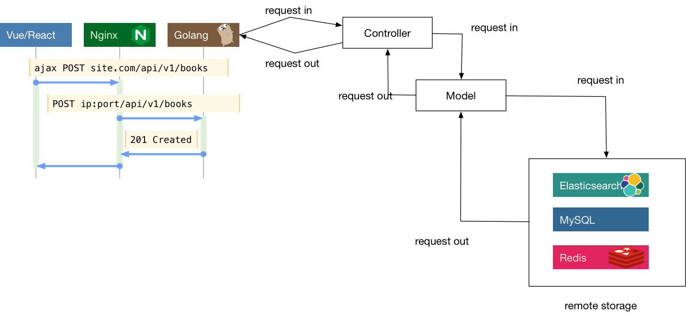

*(Kiến trúc MVC mẫu tham khảo. Trích từ ZaloPay GitBook, chương 4, phần 4.7)*

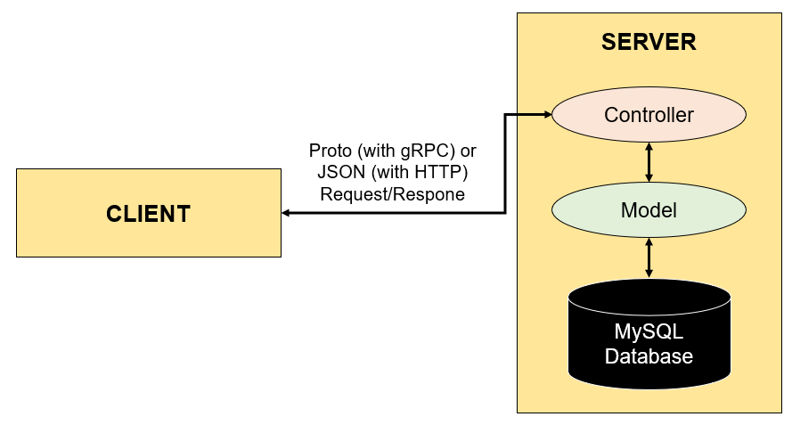

*(Kiến trúc MVC của hệ thống trong bài tập này)*

* Giải thích:
    * Client gửi, nhận thông tin thông qua giao thức HTTP/HTTPS (dữ liệu được định dạng bởi JSON), hoặc gRPC (dữ liệu được xác định bởi dạng Protocol Buffers). 
    * Phía Server nhận được thông tin từ Client hoặc gửi thông tin đến Client thông qua Controller của nó. 
    * Nếu cần truy cập dữ liệu từ CSDL (MySQL), Controller dùng Model để yêu cầu và nhận dữ liệu từ nó. 
    * Model, là nơi trực tiếp truy cập vào CSDL để thao tác, truy vấn dữ liệu. Hệ thống sử dụng GORM để thao tác.

<div id='id-section3-2-6'/>

**SEQUENCE DIAGRAM**

`SYSTEM USECASE OF RPS`

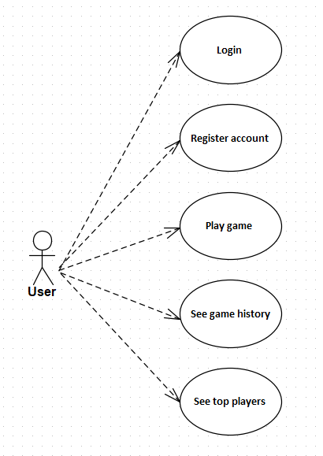

`LOGIN SEQUENCE DIAGRAM OF RPS`

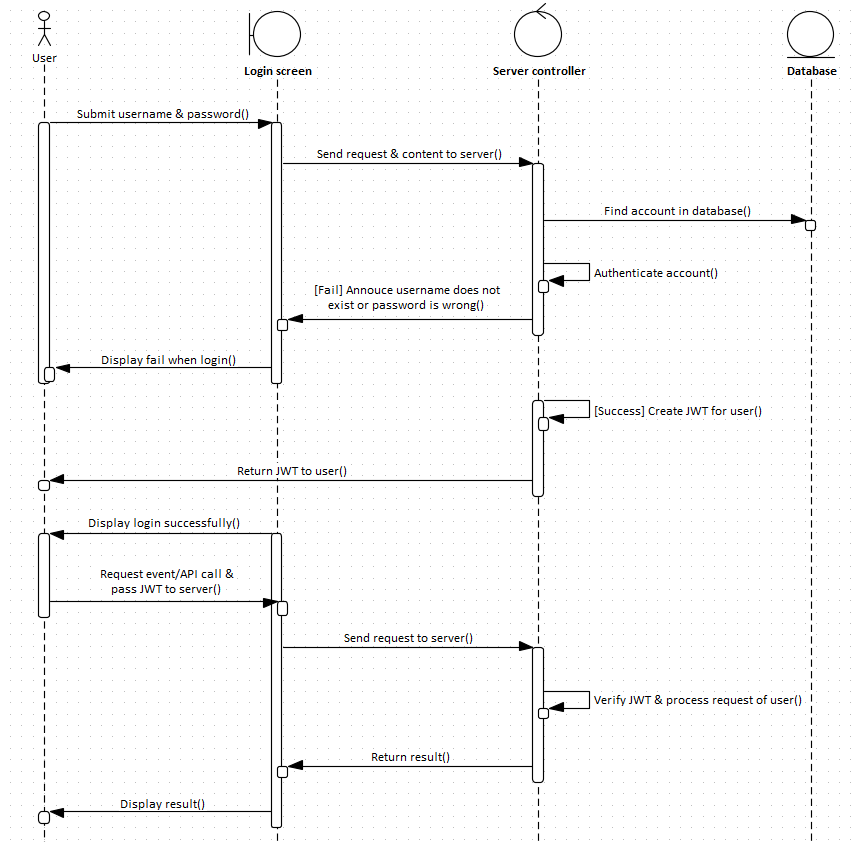

`REGISTER SEQUENCE DIAGRAM OF RPS`


`PLAY GAME SEQUENCE DIAGRAM OF RPS`

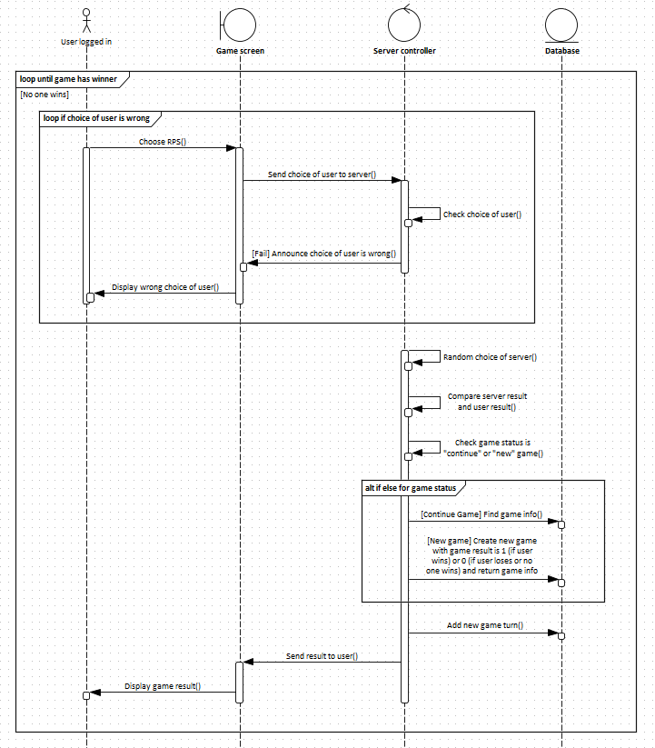

`SEE TOP PLAYERS SEQUENCE DIAGRAM OF RPS`

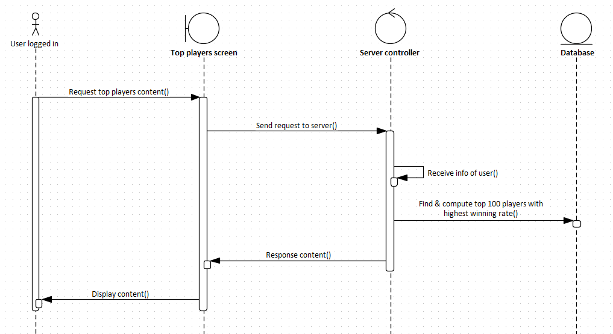

`SEE GAME HISTORY SEQUENCE DIAGRAM OF RPS`

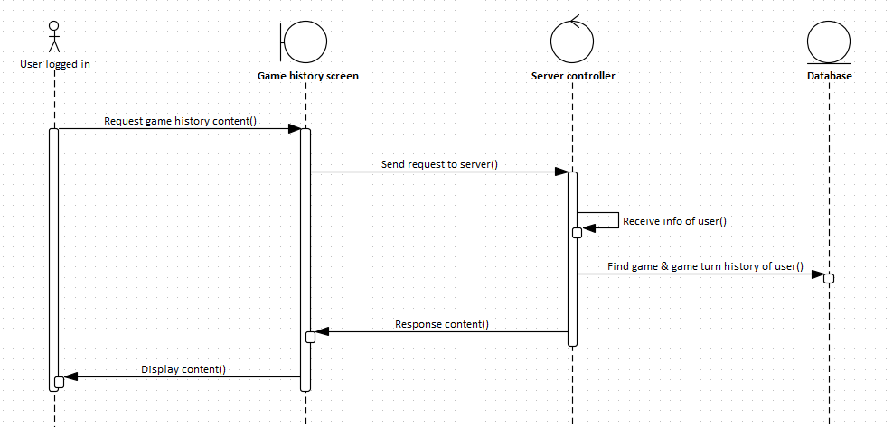

*Chú thích tính năng SeeGameHistory: Hiện trong bài tập này, ứng dụng không trả kết quả là tập hợp của game & gameturn dựa trên cùng một gameId, mà tách phần lấy dữ liệu gameturn thành một API riêng biệt dựa trên gameId (param) được gửi đến.*

<div id='id-section3-2-7'/>

**TỔ CHỨC THƯ MỤC CỦA BÀI TẬP**

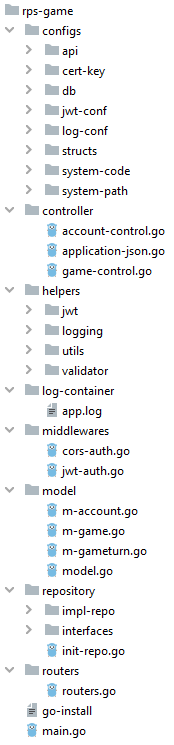

* Thư mục configs: 
    * Nơi chứa toàn bộ thông tin cấu hình của hệ thống, như: Đường dẫn api, chứng chỉ SSL/TLS, thông tin cơ sở dữ liệu, JWT, logging,...
    * Vì toàn bộ cấu hình nằm ở đây nên sau này, ta sẽ dễ dàng thay đổi các giá trị cấu hình, dễ dàng bảo trì cũng như thêm mới.
* Thư mục controller: 
    * Nơi xử lý toàn bộ nghiệp vụ của hệ thống.
    * Controller sẽ gọi đến các repository đã được cài đặt, để truyền nhận dữ liệu với database.
    * Đồng thời, phần nhận các request từ client ở controller cũng được tách ra riêng, đó là "routers".
* Thư mục helpers: 
    * Nơi chứa toàn bộ các hàm quan trọng, cần thiết và sẽ được sử dụng xuyên suốt toàn bộ chương trình, nhằm hỗ trợ các hàm khác thực thi công việc của chúng.
* Thư mục log-container: 
    * Nơi chứa toàn bộ file dữ liệu được ghi log từ server: Các lỗi, thông tin, cảnh báo,...
    * Sử dụng thư viện "lumberjack" để giúp việc ghi log có thể được "rotate" theo định kỳ thời gian, hoặc dung lượng file đã đạt đến ngưỡng tối đa cho phép.
* Thư mục middlewares: 
    * Nơi chứa các hàm trung gian nằm giữa các request và response. 
    * Khi có request đến, các hàm middleware được sử dụng để tiền xử lý trước khi đến phần controller thực thi, cũng như là hậu xử lý sau khi controller thực thi, nghĩa là trước khi response.
* Thư mục model: 
    * Nơi chứa các file "m-XXX" là các cấu trúc (struct) ứng với mỗi table ở trong database. Chúng được sử dụng để tạo cấu trúc bảng ở database, mapping với các đối tượng dữ liệu trước hoặc sau khi truy vấn,...
    * File model có nhiệm vụ tạo DatabaseInstance, kết nối với cơ sở dữ liệu và bảng. Ở đây, RPS dùng GORM.
* Thư mục repository: 
    * Repository giúp cho các lập trình viên có thể sử dụng để truyền nhận dữ liệu ở database một cách dễ dàng với các hàm đã được cài đặt sẵn, hạn chế việc sử dụng trực tiếp biến DatabaseInstance ở model, bảo trì các code xử lý thuần túy về truy vấn dữ liệu một cách dễ dàng, và giúp tách bạch rõ ràng phần model với phần controller.
    * Thư mục interfaces: Nơi thiết lập các interface cần được cài đặt và chúng sẽ được sử dụng trong chương trình (sau khi được cài đặt và khởi tạo).
    * Thư mục impl-repo: Cài đặt các interface cần thiết.
    * File init-repo: Khởi tạo các biến toàn cục dựa trên những interface và các hàm cài đặt interface để lập trình viên sử dụng.
* Thư mục routers: File routers là nơi sẽ nhận các request từ client theo API được chỉ định, và gọi các hàm xử lý ở middleware hoặc ở controller cần thiết.
* File go-install: Các thư viện (và câu lệnh cài đặt) mà hệ thống đang sử dụng.
* File main.go: Khởi tạo các biến toàn cục, hàm cần thiết và khởi chạy chương trình.

    ```
    Trình tự từ khi server nhận request đến thao tác dữ liệu:
    
    1> router (must have)
    2> middlewares (nice to have) + helpers (nice to have)
    3> controllers (must have) + helpers (should have)
    4> repository (must/should have)
    5> model (must have)
    6> database (must have)
    
    (Việc sử dụng các thông tin cấu hình và ghi nhận log sẽ diễn ra xuyên suốt chương trình)
    ```

<div id='id-section3-2-8'/>

**NGOÀI LỀ**

* Cây thư mục hoặc tên được đặt có thể thay đổi theo kiến trúc hệ thống, nghiệp vụ hoặc cảm giác thuận tiện của mỗi cá nhân, nhóm. Các thư viện hay plugins khác có thể thêm vào cây thư mục với vị trí mà bản thân mong muốn, nhưng vẫn cần phải thỏa về mặt quy ước thiết kế, lập trình chung.
* Controller và Model nằm ở phía server, được chia tách thành các phần nhỏ hơn để dễ dàng quản lý, bảo trì cũng như mở rộng. Ngoài ra, có thể đặt View (Giao diện Web) tại đây. Tuy nhiên, ta cũng có thể phát triển phần View như là một service/system khác với các nghiệp vụ/yêu cầu khác, nó sẽ tách bạch hoàn toàn với system này, và system này sẽ publish các API cần thiết cho nó hoặc các service khác sử dụng. Đồng thời, các service khác nhau cũng có thể gọi lẫn nhau, hoặc các service khác nhau sẽ gọi đến duy nhất một hệ thống core này (microservice). Phương thức truyền tải là gRPC (thay vì là HTTP thông thường) để tăng tốc truyền nhận dữ liệu, request, response; hoặc có thể kết hợp sử dụng Apache Kafka (nền tảng stream dữ liệu phân tán giữa các service/system).

<div id='id-section3-2-9'/>

**PERFORMANCE TEST**

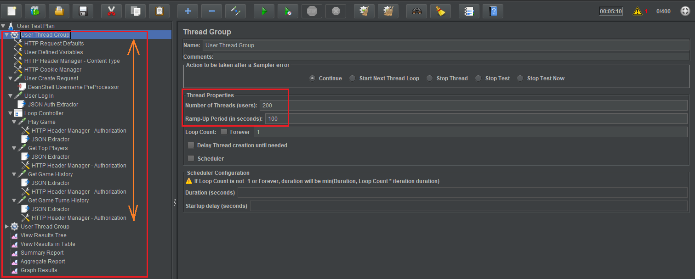

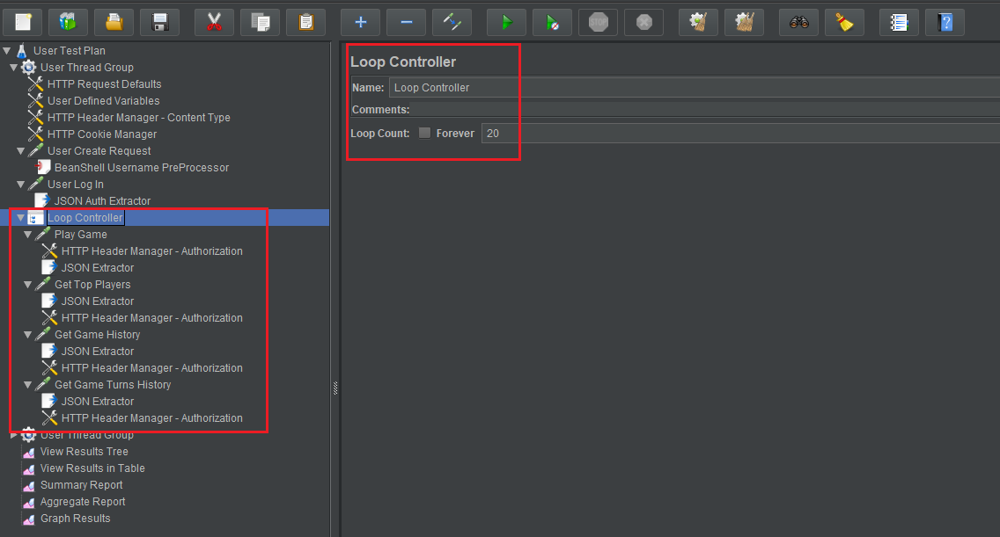

* Cấu hình: Chương trình có 2 User Thread Group giống nhau, mỗi User Thread Group sẽ gồm những thành phần dưới:
    * Number of threads (users): 200 users.
    * Ramp-Up Period (in seconds): 100 giây. RUP là tổng thời gian khởi động hết tất cả các yêu cầu. Ở đây có 200 users ứng với 200 requests, cứ mỗi 0,5 giây (100 giây / 200 users) sẽ có 1 request được thực thi.
    * Loop count: 1, toàn bộ chương trình test chỉ diễn ra 1 lần.
    * 6 API chính, trong đó có 2 API chỉ thực hiện một lần và 4 API chơi game được đưa vào vòng lặp (Loop Controller):
        * "User Create Request" và "User Log In" là 2 API mà mỗi user sẽ gửi request chỉ một lần, theo thứ tự.
        * Loop Control với số lần loop là 20, chứa 4 API "Play Game", "Get Top Players", "Get Game History" và "Get Game Turns History". Mỗi user sẽ gửi request đến 3 API này với số lần là 20 request ở mỗi API.
    * Các phương thức Listener và Extractor phụ trợ khác.

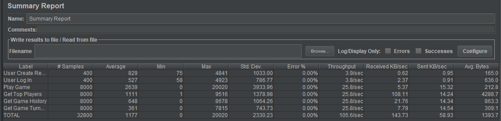

* Kết quả:
    * Như vậy, kịch bản thử nghiệm này thực hiện với 2 nhóm user hoàn toàn khác nhau (User Thread Group), mỗi nhóm sẽ có 200 users (Number of Threads) và 20 loops cho các API phục vụ việc chơi game.
    * Giải thích sơ lược một vài thông số cần quan tâm từ ảnh trên:
        * Sample: Lượng request được gửi đến server.
        * Min: Thời gian response nhỏ nhất (ms).
        * Max: Thời gian response lớn nhất (ms).
        * Error rate: Tỉ lệ các bài test thất bại (trong lúc JMeter chạy).
        * Throughput: Bao nhiêu request mỗi giây mà server có thể xử lý (Số càng lớn càng tốt).
        * Avg. Bytes: Kích cỡ trung bình (theo byte) của các gói response.
* Lưu ý: Kết quả test chỉ mang tính chất tham khảo vì còn phụ thuộc vào cấu hình server (máy tính), tình hình sử dụng thực tế. Dĩ nhiên, ta có thể cải thiện kết quả để tốt hơn nữa với các hình thức khác nhau: Tối ưu mã code, thêm server, nâng cao cấu hình server,...

<div id='id-section3-2-10'/>

**SSL/TLS**

* Về việc tạo chứng chỉ SSL/TLS, có thể xem nhiều loại và cách tạo khác nhau: [zytrax.com](https://www.zytrax.com/tech/survival/ss.html)

<div id='id-section3-2-11'/>

**TÌNH HÌNH**

* Kết quả bài tập chưa cài đặt để trải nghiệm gRPC.
* Hiện tại bài tập chưa có Unit/Integration test.
